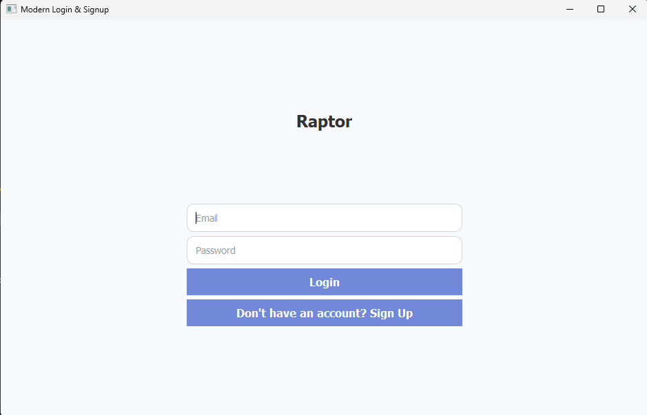

# PROJECT RAPTOR

## Overview
PROJECT RAPTOR is a simulation of a stock exchange platform implemented using fundamental networking protocols such as **TCP**, **IP**. This project provides a practical understanding of networking basics while simulating real-world stock market operations.

## Key Features
- 🗄️ **Database**: Utilizes **Firebase** for storing:
  - Stock details
  - Customer details
  - Banking information
- 🌐 **Networking**:
  - Implements fundamental networking protocols for communication.
- 💻 **Platform**:
  - Developed as a desktop application.
  - **UI Framework**: Built using **PyQT** for interface design. For faster performance, consider experimenting with **Java** for the UI.

## Goals
The main objective of PROJECT RAPTOR is to provide a clear understanding of base networking protocols, which form the backbone of modern networking systems.

## Prerequisites
1. Ensure you have Python installed with the following libraries:
   - PyQT
   - Firebase dependencies
2. Compatible operating systems:
   - **Windows**
   - **Linux**

## Setup Instructions
### Step 1: Configure IP Addresses
- 🛠️ Use the appropriate **IPv4 addresses** for your devices.
- To find the IPv4 address:
  - **Windows**: Open Command Prompt and run:
    ```bash
    ipconfig
    ```
  - **Linux**: Open Terminal and run:
    ```bash
    ifconfig
    ```

### Step 2: Running the Application
Run the following components **simultaneously** on different devices connected to the same network, or in separate terminals on a single machine:
1. **Banking Server**
2. **Client**
3. **Main Server**

#### Example:
1. Start the **Banking Server**:
   ```bash
   python bankingserver.py
   ```
2. Start the **Main Server**:
   ```bash
   python server.py
   ```
3. Start the **Client Application**:
   ```bash
   python client.py
   ```

## Screenshots
(assets/main_page.png)(assets/portfolio.png)
*📸 Example of the user interface designed with PyQT.*

## Notes
- ⚠️ Ensure all three components are running on devices connected to the same network.
- 🔍 Triple-check the IP addresses configured in the code.
- 🖥️ For smoother performance, explore Java-based UI development if required.

## Troubleshooting
### Common Issues
1. **Connection Errors**:
   - 🔌 Verify that the devices are connected to the same network.
   - ✅ Confirm that the correct IPv4 addresses are used.
2. **Firebase Authentication**:
   - 🔑 Ensure proper Firebase credentials are configured.
   - 🌐 Check internet connectivity.

## Future Improvements
- 🚀 Transition to a faster UI framework like **JavaFX** or **Swing**.
- 🔒 Enhance database security.
- 📡 Implement advanced networking features such as **SSL/TLS** for secure communication.

---

